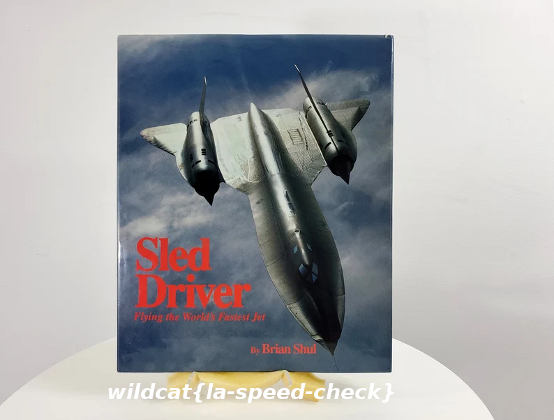

# Brian Shul Solution

Word documents are actually zip containers.  You can extract many files from the
typical office document, and have a look around the inside of them.  This hidden
data could accidentally contain private information.  There are even metadata
removal programs that you can buy to help with this problem.

Unzip either file and then browse through the extracted contents until you see
the pictures.  The flag is in the picture.

```
$ unzip Brian_Shul.docx 
Archive:  Brian_Shul.docx
  inflating: _rels/.rels             
  inflating: docProps/core.xml       
  inflating: docProps/app.xml        
  inflating: word/_rels/document.xml.rels  
  inflating: word/document.xml       
  inflating: word/media/image1.png   
  inflating: word/styles.xml         
  inflating: word/fontTable.xml      
  inflating: word/settings.xml       
  inflating: [Content_Types].xml     
  inflating: word/media/image2.png   
```

The second picture was cropped inside of Open Office.  Open Office lazily just
stores the whole picture in the document file, and crops it when it is
rendered.



When I wrote the challenge, I tested in a version of office I had access to, and
google docs.  But the build-in Wordpad program in Windows ignores the cropping
and actually unbeknownst to me, spoils the challenge!
